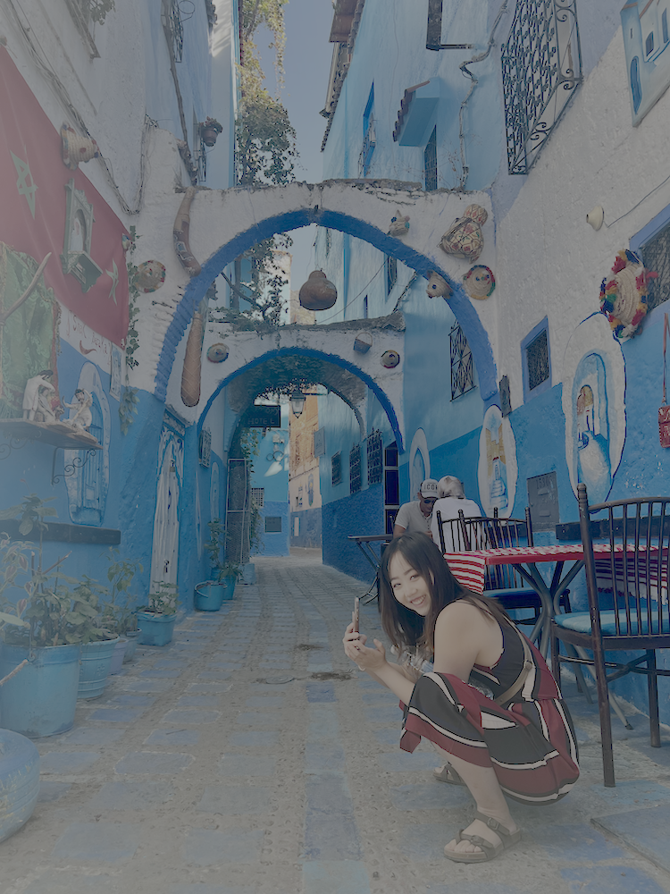

I'm a research associate in the [Fields Lab for Orthopaedic Biomechanics and Biotransport](https://fieldslab.ucsf.edu/) at UCSF. I'm currently studying chronic low back pain as part of the [Back Pain Consortium Research Program](https://heal.nih.gov/research/clinical-research/back-pain) (BACPAC), a collaborative effort funded by the [NIH Heal Initiative](https://heal.nih.gov/) aimed at understanding and treating chronic low back pain (cLBP).

My recent work focuses on developing and utilizing advanced, quantitative MRI-based methods to characterize endplate damage and other spinal pathologies that are often overlooked in standard clinical assessments. A large part of this research involves designing models that can extract meaningful biomarkers associated with cLBP for better pain phenotyping. I'm particularly interested in how we can move beyond conventional, descriptive imaging toward more predictive, mechanistic insights that support personalized approaches to treatment.

Prior to work, I did a Master's thesis in Biomedical Imaging on MEG inference using ML at the [Brain Networks Lab](https://rajlab.ucsf.edu/) at UCSF, and my BA Honours dissertation on mathematical modeling of cone phototransduction with Dr. [Hugh Matthews](https://www.pdn.cam.ac.uk/directory/hugh-matthews) at the University of Cambridge.

In my free time, I love to travel, do yoga, make music, and cook + eat delicious food :) See my Beli restaurant rankings [here](https://beliapp.co/app/jiamineats), or add me as a friend on NYT Games [here](https://www.nytimes.com/crosswords/apps?code=1d19cb3c-c5cd-4ea9-bf8e-ddaf54e67316).

Feel free to contact me on social media if you want to talk more!

<figure class="captioned-image">
  
  <figcaption>
    The optimal pose for taking pics of stray cats // Chefchaouen, Oct 2022.
  </figcaption>
</figure>